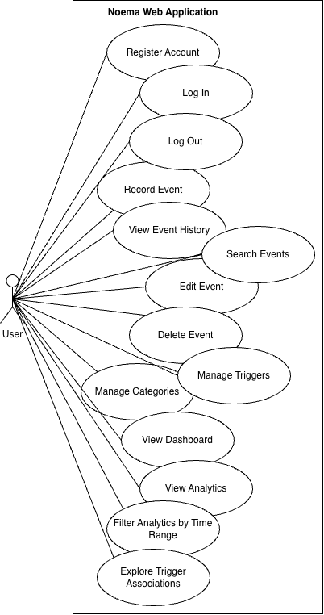
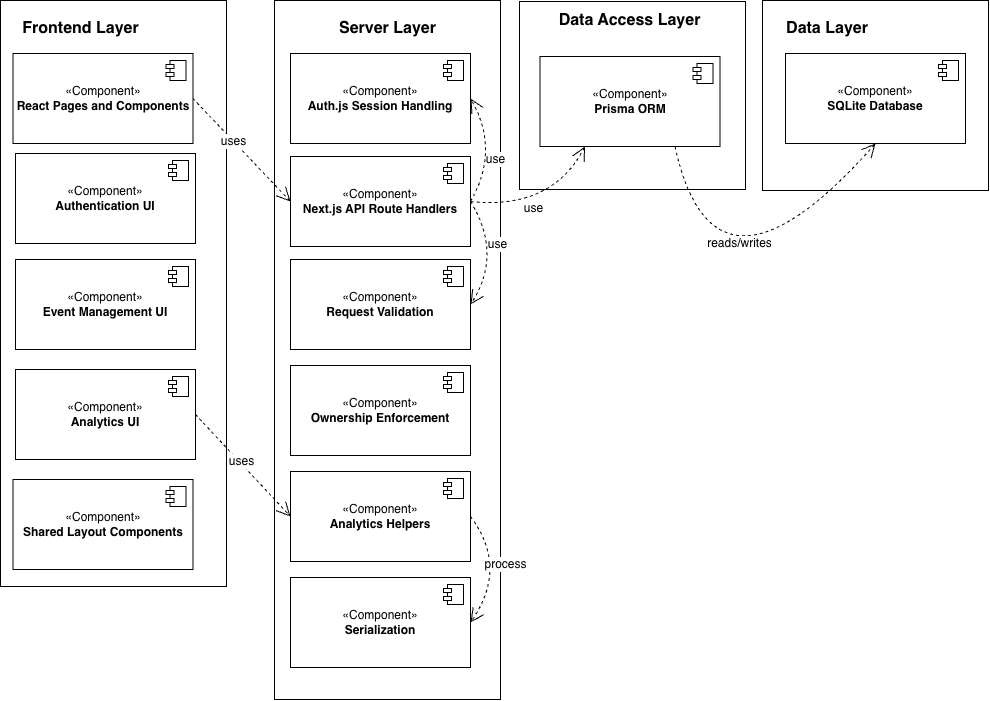
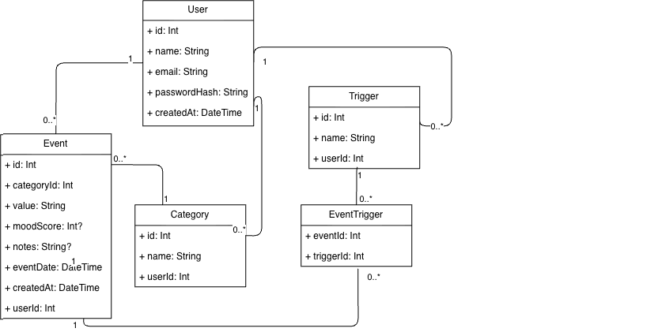
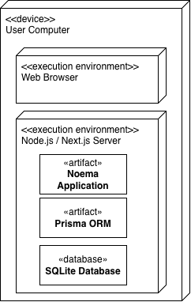
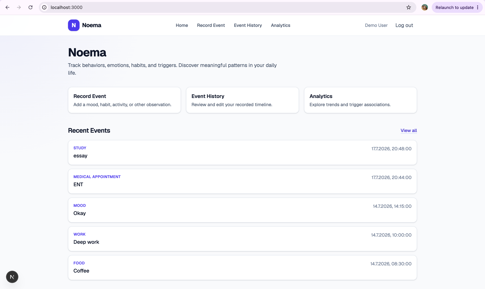
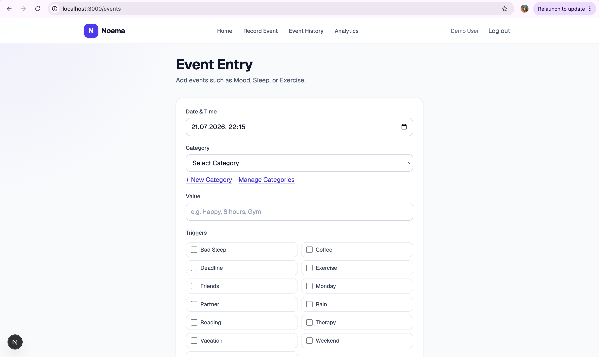
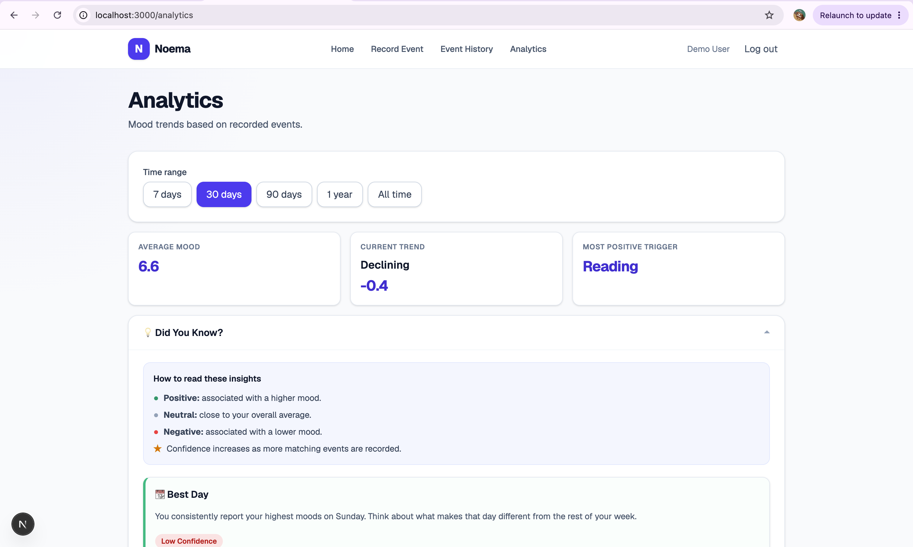
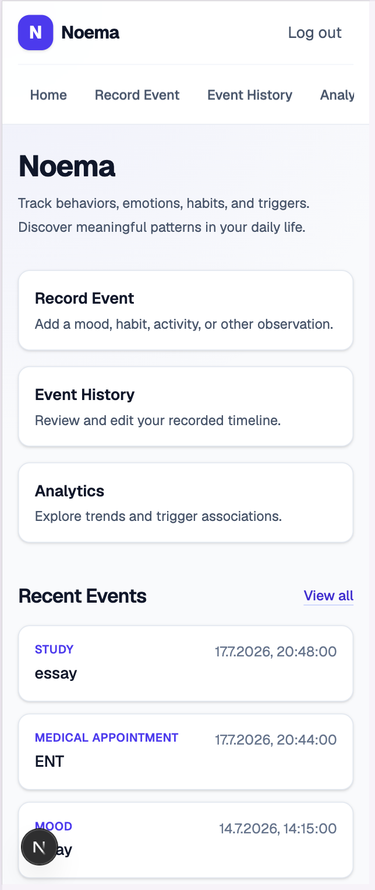

# Noema

Noema is a personal event-tracking and analytics application. It allows users to record moods, habits, activities, health-related events, and contextual triggers, then explore patterns in their own data.

## Features

- User registration and credential-based authentication
- User-specific event data
- Custom categories and triggers
- Mood scores from 1 to 10
- Multiple triggers per event
- Event creation, editing, deletion, and search
- Time-range filtering
- Mood trends and distributions
- Trigger associations
- Trigger-pair associations
- Confidence labels based on sample size
- Generated personal insights
- Loading, error, and empty states
- Responsive interface
- Server-side ownership and validation checks

## Technology Stack

- Next.js
- React
- TypeScript
- Tailwind CSS
- Prisma ORM
- SQLite
- Auth.js / NextAuth
- Recharts
- Vitest

## Application Architecture

The application uses the Next.js App Router.

- Pages and UI components are rendered through the `app` directory.
- API route handlers validate requests and enforce user ownership.
- Auth.js manages credential authentication and JWT sessions.
- Prisma provides access to the SQLite database.
- Analytics helper functions process serialized event data.
- Vitest is used for automated unit testing.

## Data Model

### User

A user owns:

- events;
- categories;
- triggers.

### Event

An event:

- belongs to one user;
- belongs to one category;
- contains a value;
- may contain a mood score;
- may contain notes;
- has an event date;
- may be connected to zero or more triggers.

### Category

A category belongs to one user and may be used by many events. Category names are unique per user after case-insensitive normalization.

### Trigger

A trigger belongs to one user and may be connected to many events. Trigger names are unique per user after case-insensitive normalization.

### EventTrigger

`EventTrigger` implements the many-to-many relationship between events and triggers.

## Architecture Diagrams

### Use Case Diagram



### Component Diagram



### Class Diagram



### Deployment Diagram



## Authentication and Data Isolation

Noema uses credential authentication through Auth.js.

Passwords are hashed before storage. API routes resolve the authenticated user and restrict reads, updates, and deletions to records belonging to that user.

Category and trigger names are checked case-insensitively to prevent duplicate variants such as `Work` and `work`.

## Analytics

The analytics dashboard includes:

- average and latest mood;
- mood trend;
- mood distribution;
- event and category counts;
- trigger-linked mood averages;
- trigger explorer;
- trigger-pair associations;
- generated personal insights;
- confidence labels based on matching entry count.

Analytics describe associations in the recorded data and do not establish causation.

## Confidence Levels

Confidence labels are based on the number of matching recorded entries:

- Low: fewer than 10 entries
- Moderate: 10–29 entries
- High: 30 or more entries

## Trigger-Pair Associations

Trigger-pair analysis creates every unique pair of triggers attached to the same mood event.

For each pair, Noema calculates:

- average mood;
- number of matching entries;
- difference from the overall mood average.

Pairs require at least three matching entries before they are displayed.

## Screenshots

### Home Dashboard



### Event Entry



### Analytics Overview



### Mobile Layout



## Installation

Clone the repository:

```bash
git clone https://github.com/helenaaelges-hue/noema.git
cd noema
```

Install dependencies:

```bash
npm install
```

Create the environment file:

```bash
cp .env.example .env
```

Replace the placeholder `AUTH_SECRET` in `.env` with a secure random value before starting the application. A secret can be generated locally with:

```bash
openssl rand -base64 32
```

Run the database migrations:

```bash
npx prisma migrate dev
```

Seed the development database:

```bash
npm run seed
```

Start the development server:

```bash
npm run dev
```

Open:

```text
http://localhost:3000
```

## Environment Variables

Noema requires:

```env
DATABASE_URL="file:./dev.db"
AUTH_SECRET="replace-with-a-secure-random-secret"
```

Do not commit a real authentication secret.

## Available Commands

```bash
npm run dev
npm run build
npm run start
npm run lint
npm run seed
npm test
npm run test:run
```

## Demo Account

After running the seed script:

```text
Email: demo@noema.local
Password: demo12345
```

## Testing

Automated unit tests cover:

- moving averages;
- time-range filtering;
- mood averaging;
- confidence thresholds;
- trigger grouping;
- trigger-pair generation;
- category and trigger name normalization;
- malformed JSON request handling.

Run the full test suite:

```bash
npm run test:run
```

Create a production build:

```bash
npm run build
```

## Manual Testing

The application was manually tested for:

- registration and login;
- logout;
- protected-route redirects;
- event creation, editing, deletion, and search;
- user data isolation;
- duplicate category and trigger handling;
- blocked deletion of categories and triggers currently in use;
- loading, error, and empty states;
- analytics time filtering;
- responsive layouts;
- keyboard navigation.

## Known Limitations

- The assessed prototype uses SQLite and is intended for local execution and demonstration.
- A conventional stateless cloud deployment would require persistent filesystem storage or migration to a hosted relational database such as PostgreSQL.
- Analytics depend on the quantity and quality of user-entered data.
- Confidence labels represent sample size, not scientific certainty.
- Associations in the recorded data do not establish causation.
- The current automated test suite focuses mainly on pure helper functions rather than full browser-based integration tests.

## Deployment Considerations

The current implementation uses SQLite for local development and demonstration.

For a production deployment, the recommended next step is migrating the database to hosted PostgreSQL while retaining Prisma as the ORM. This would avoid reliance on a local writable database file in a stateless cloud environment.

## Author

Helena Elges